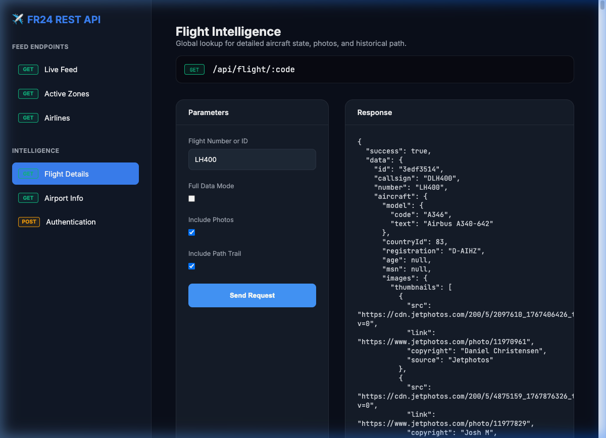

# FlightRadar24 REST API (Nativ Node.js)

<p align="center">
  [Read in English (Englisch) 🇺🇸](README.md)
</p>

<p align="center">
  <a href="https://vercel.com">
    
  </a>
  <a href="https://nodejs.org">
    
  </a>
  <a href="https://opensource.org/licenses/MIT">
    
  </a>
  
  
</p>

Eine hochperformante, native REST-API für FlightRadar24-Flugdaten, optimiert für lokale Entwicklung und Vercel Serverless. Entwickelt ohne externe SDK-Abhängigkeiten, unter Verwendung von reinem Node.js.

<p align="center">
  <a href="#schnellstart">Schnellstart</a> •
  <a href="#web-konsole">Web Konsole</a> •
  <a href="#anwendungsbeispiele">Beispiele</a> •
  <a href="#authentifizierung">Authentifizierung</a> •
  <a href="#vercel-serverless-deployment">Deployment</a> •
  <a href="#roadmap">Roadmap</a> •
  <a href="#haftungsausschluss">Haftungsausschluss</a>
</p>

<p align="center">
  
  
  
</p>

---

## 🛠 Tech Stack

<div align="center">
  
  
  
  
</div>

## 🏗 Architektur & Bereinigung

Das Projekt wurde für maximale Wartbarkeit und Performanz optimiert:
- **Unified Logic**: Alle API-Routen und Logiken befinden sich zentral in `app.js`.
- **Lokal & Serverless**: Sowohl `server.js` (lokal) als auch `api/fr24/index.js` (Vercel) nutzen den identischen Code. Keine doppelten Anpassungen mehr nötig!
- **Vercel Ready**: Dank `vercel.json` wird das gesamte Projekt (inkl. Frontend) nahtlos in der Cloud ausgeführt.

---

## 🚀 Schnellstart

```bash
# Klonen & Installieren
git clone https://github.com/jonaskroedel/fr24REST.git
cd fr24REST
npm install

# Umgebung einrichten (Optional für Auto-Auth)
cp .env.example .env
# .env mit deinen FR24-Zugangsdaten bearbeiten

# Server starten
node server.js
```

## 🖥 Web Konsole

Das Projekt enthält eine integrierte, stylische Konsole zum visuellen Testen der API. Starte den Server und öffne:
**[http://localhost:3000](http://localhost:3000)**



---

## 📥 API Kollektion

Für schnelles Testen mit **Insomnia** oder **Postman** kannst du die mitgelieferte Collection importieren:
👉 [insomnia_collection.json](insomnia_collection.json)

---

## Anwendungsbeispiele

Dies ist eine Standard-REST-API und kann in jede Umgebung integriert werden.

### 1. Einfaches Abrufen (Zusammenfassung)

Gibt grundlegende Daten zurück (ID, Nummer, Flugzeug, Start, Ziel, Status).

#### cURL
```bash
curl -s "http://localhost:3000/api/flight/LH400"
```

#### Python (requests)
```python
import requests

response = requests.get("http://localhost:3000/api/flight/LH400")
data = response.json()
print(f"Flug: {data['data']['number']} - Status: {data['data']['status']['text']}")
```

#### JavaScript (Fetch)
```javascript
const response = await fetch("http://localhost:3000/api/flight/LH400");
const { data } = await response.json();
console.log(`Verfolge Flug ${data.id} (${data.callsign})`);
```

> [!TIP]
> Schau dir das [examples/](examples/) Verzeichnis an für vollständige, eigenständige Skripte in **JavaScript** und **Python**.

### 2. Erweiterte Daten (Opt-in)

Inklusive Flugzeugfotos und vollständiger historischer Pfad-Koordinaten.

```bash
# Fotos und Flugpfad hinzufügen
curl -s "http://localhost:3000/api/flight/LH400?photos=true&trail=true"
```

---

## Authentifizierung

### Natives Auto-Login
Wenn du deine Zugangsdaten in einer `.env` Datei speicherst (`FR24_EMAIL` & `FR24_PASSWORD`), authentifiziert sich die API bei Bedarf automatisch. 

### Manueller Login
Alternativ kannst du den `/api/login` Endpoint nutzen:

#### JavaScript (Login)
```javascript
const credentials = { email: "deine@email.de", password: "deinpasswort" };
const response = await fetch("http://localhost:3000/api/login", {
    method: "POST",
    headers: { "Content-Type": "application/json" },
    body: JSON.stringify(credentials)
});
const result = await response.json();
console.log("Login Status:", result.success);
```

### Parameter für /api/flight/:code
| Parameter | Typ | Beschreibung |
| :--- | :--- | :--- |
| `full` | `boolean` | Gibt den gesamten Rohdatensatz und alle Trackpunkte zurück. |
| `photos` | `boolean` | (Opt-in) Enthält Galerien von Flugzeugfotos. |
| `trail` | `boolean` | (Opt-in) Enthält detaillierte Flugpfad-Koordinaten. |
| `airports` | `boolean` | (Opt-in) Enthält vollständige Metadaten für Start/Ziel. |

### Parameter für /api/airports/:code
| Parameter | Typ | Beschreibung |
| :--- | :--- | :--- |
| `weather` | `boolean` | (Opt-in) Enthält aktuelle METAR- und Wetterdaten. |
| `schedule` | `boolean` | (Opt-in) Enthält Ankünfte und Abflüge des Flughafens. |
| `runways` | `boolean` | (Opt-in) Enthält technische Daten der Startbahnen. |
| `aircraftCount` | `boolean` | (Opt-in) Enthält Statistiken über Flugzeuge am Boden/Luft. |

---

## ☁️ Vercel Serverless Deployment

Das Deployment auf Vercel ist für die zustandslose Ausführung optimiert:

```bash
vercel --prod
```

## 🗺 Roadmap

- [ ] **Echtzeit Webhook Support**: Push-Updates an externe Endpunkte.
- [ ] **Protobuf Support**: Nativ dekodierte Daten für noch höhere Performance.
- [ ] **Interaktive Karte**: Integration eines Leaflet/Mapbox-Frontends.
- [ ] **Multi-Session Handling**: Unterstützung für mehrere Account-Cookies.

## ⚖️ Haftungsausschluss

> [!CAUTION]
> ### NUR UND AUSSCHLIESSLICH FÜR BILDUNGSZWECKE
> Dieses Projekt dient **einzig und allein Bildungszwecken**. Es soll demonstrieren, wie man mit nativen Node.js-Tools mit öffentlichen APIs interagiert. Die Nutzung erfolgt auf eigene Gefahr. Bitte respektiere die Terms of Service von FlightRadar24. Der Autor übernimmt keine Haftung für Missbrauch oder Schäden.

---

## Star History

<div align="center">
  <a href="https://star-history.com/#jonaskroedel/fr24REST&Date">
    
  </a>
</div>

## Repository Struktur
- `app.js`: Zentrale Express-App (Gemeinsame Logik).
- `/api/fr24/`: Vercel Serverless Einstiegspunkt.
- `/services/`: Kern-Anfrage & Scraper-Logik.
- `/models/`: Daten-Mapping & Entity-Definitionen.
- `/public/`: Frontend (Interaktive Konsole).
- `server.js`: Lokaler Express Listener.
- `vercel.json`: Vercel Routing & Konfiguration.

---

<p align="center">
  Erstellt von <a href="https://github.com/jonaskroedel">jonaskroedel</a> mit ♥ für Flugbegeisterte
</p>
